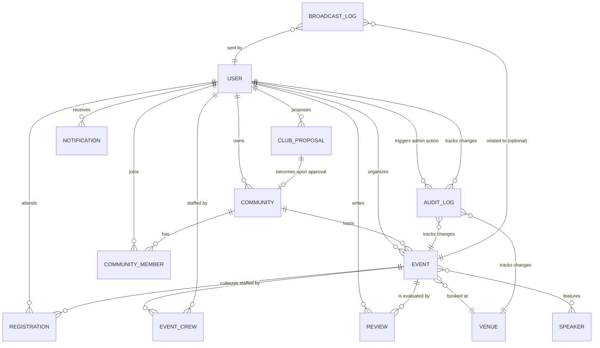

# Merit## System Architecture & Logic (MERN)

### Robust Path Normalization for Local/Cloud Assets

**Strategy**: Standardizing how the system handles file paths between the local filesystem (development) and public URLs (production/cloud) is critical for consistent media rendering.

- **Backend (Node/Express)**: Always save relative paths starting with a leading slash (e.g., `/public/uploads/assets/...`). This ensures the database stores "clean" public references that don't leak server-specific absolute paths (e.g., `C:/Users/...`). Use `path.relative(process.cwd(), file.path)` to generate these.
- **Frontend (React)**: Implement a resilient URL mapper that handles three scenarios:
  1. **Absolute URLs**: If the path starts with `http`, use it as is (useful for Cloudinary/S3 integration).
  2. **Leading Slashes**: Ensure paths have exactly one leading slash before prefixing with the `API_BASE`.
  3. **Local Leaks**: Filter out or replace any remaining absolute local paths (e.g., containing `:/`) with placeholders to prevent broken UI states.

### Debugging React Reference Errors (Framer Motion)

**Context**: Features using high-fidelity animations frequently rely on libraries like `framer-motion`.

- **Common Pitfall**: Using the `motion` component (e.g., `<motion.div>`) without explicitly importing it, even if other components from the same library (like `AnimatePresence`) are imported.
- **Resolution**: Ensure every file using `motion.*` includes `import { motion } from "framer-motion"`. In complex projects, shared animation wrappers or higher-order components can help reduce import boilerplate and ensure consistency.

## Tech Stack Constraints

## Overview

The Merit System is a core gamification feature that rewards students for attending events. It is fully integrated between the backend database and the frontend Profile UI.

## Data Flow

1.  **Event Definition**: Each `Event` document has a `merit_points` field.
2.  **Attendance Trigger**: When a student scans their QR Code at an event, the `registrationController.checkIn` function executes.
3.  **Database Update**: The backend adds `event.merit_points` to the `User`'s `current_merit` field using `$inc`.
4.  **Frontend Binding**: `Profile.jsx` fetches the user data and maps `userData.current_merit` to the `xp` prop of the gamification component.
5.  **Visualization**: `RankAscension.jsx` takes the raw XP value and calculates the current Rank (Cadet, Scout, etc.) and progress percentage towards the next rank.

## Key Constraints

- **High Performer**: (Revenue > Mean) && (Rating >= 4.0).
- **Quality Issue**: (Revenue > Mean) && (Rating < 3.5).
- **Community Builder**: (Attendance > Mean) && (Ticket Price < Median).
- **Needs Attention**: (Attendance < Mean) && (Revenue < Mean).

### B. Strategic Insight Logic

- **Revenue Concentration**: Analyzes Gini-coefficient style distribution of revenue across categories to identify growth dependency.
- **Sentiment Thresholding**: Triggers warnings if sentiment scores drop below **70%** despite high engagement, signifying technical or operational friction.
- **Audience Demand Matching**: Correlates high sentiment (**>90%**) with low frequency to recommend expansion in high-potential niches.

## 2. Digital Pass Architecture (Student Experience)

The "Digital Pass Wallet" transitions the system from simple booking lists to a high-fidelity credential system.

- **Visual Psychological Cues**: Uses perforation effects and high-contrast typography to increase perceived value and professionalism.
- **Data Densification**: Groups fragmented event data (Venue, Time, Category, Merit) into a single scan-ready component (QR-based check-in).

## 3. Financial Stewardship (Organizer Tools)

The Finance module implements real-time GAAP-adjacent tracking for independent organizers.

- **KPI Trend Analysis**: Uses Month-over-Month (MoM) growth calculations to provide organizers with immediate feedback on marketing campaign efficacy.
- **Revenue-by-Category Visualizations**: Implements a percentage-share breakdown to allow organizers to see their "Portfolio" of events at a glance.

## 4. Audit Trail & Transparency (Security)

The system maintains a comprehensive audit log utilizing an event-sourcing lite approach.

- **Immutable Action Logging**: Every critical action (Created, Updated, Checked-in) is stamped with User, Time, and a data snapshot.
- **Snapshot Viewer**: Allows administrators to compare the state of an event before and after critical changes for accountability.

## 5. Interactive Roadmap & Collective Tasking

The dashboard implements a real-time coordination layer for event staff.

- **Dynamic Run-of-Show (RoS)**: Organizers can build an event timeline on the fly. The system handles partial array updates via specialized PUT endpoints to ensure high performance and low data collision.
- **Task Synchronization**: A "shared-state" to-do list allows organizers to track operational readiness (e.g., AV checks, catering). The UI uses optimistic updates and toggles to provide a seamless management experience.
- **Management Heuristics**: The "Three-Dot" management menu on the schedule uses destructive action protection (confirmation dialogs) to prevent accidental data loss during high-pressure event execution.

## 6. Collaborative Permission Model (Security & Delegation)

The system implements a tiered authorization structure to balance security with operational efficiency.

- **Identity-Based Ownership**: Events are strictly tied to a `organizer_id`. General users and even other "Approved Organizers" are restricted from modifying events they do not own to maintain data integrity.
- **Community Leadership Permissions**: For events hosted by a specific club or organization, a **Community-Led Association Model** is applied. Authorized leaders (President, AJK, Committee, Secretary, Treasurer) are granted full **CRUD/Edit** access to community events.
- **Team Collaboration Model (Member/AJK/President)**: The system implements a shared-management approach for community events. All **Approved** members of a community (regardless of role tier) are granted **Edit** permissions on events hosted by their club. This allows collaborative efforts in managing schedules, tasks, and historical logs.
- **Dynamic Permission UI (canEdit Flag)**: The backend dynamically injects a `canEdit` boolean flag into event responses based on membership status: (Admin OR System Organizer OR Owner OR Approved Community Member). This flag controls the visibility of all management interfaces.
- **Unified Activity Log Access**: Access to "View All History" is granted to anyone with `canEdit` permissions, ensuring that the entire event team has visibility into the audit trail while restricting it for visitors.
- **Administrative Override**: Global Admins retain full CRUD capabilities across all events for mediation and oversight purposes.

## 7. Robust Data Ingestion & Sanitization (Stability)

The system implements strict defensive coding patterns to ensure state persistence across heterogeneous device environments.

- **Dynamic Type Parsing**: The frontend `EditEvent` flow performs explicit type casting (e.g., `parseInt(capacity) || 0`) for all numeric fields. This prevents "Cast Error" 400 Bad Request failures caused by `NaN` or empty strings reaching the MongoDB layer.
- **Reference Integrity**: Reference IDs (e.g., `venue_id`, `community_id`) are conditionally stripped of "placeholder" values (like "other") before submission, maintaining referential integrity in the database.
- **Cross-Component Prop Propagation**: The system uses a "Destructured Prop Safety" pattern in dashboard widgets (`InsightsPanel`, `EventTimeline`) to ensure that critical authorization flags like `canEdit` are consistently scoped, preventing ReferenceErrors during fragmented component updates.
- **Responsive Container Constraints**: Recharts components are wrapped in `ResponsiveContainer` units with explicit `min-height` and `min-width` fallback styles to prevent rendering failures and console warnings during initial layout calculations.

## 8. Organizer/Club Creation Ecosystem (Onboarding & Automation)

The system implements a seamless "Student-to-Leader" transition flow, automating the technical overhead of organization management.

- **Integrated Proposal Pipeline**: Students initiate organizer requests through a structured **Club Proposal** system. This captures legal and operational metadata (Mission, Advisor, Faculty) at the point of entry, ensuring all required organizational data is ready for platform instantiation.
- **Atomic Approval-to-Activation Logic**: The Admin approval process triggers an atomic backend operation that simultaneously:
  1. Promotes the user to the `organizer` role.
  2. Instantiates a new **Community** record based on proposal metadata.
  3. Assigns the user as the permanent **Owner/President** and first member of that community.
  4. Marks the proposal as officially **Approved** for audit purposes.
- **Metadata-Driven UI Hydration**: The Admin moderation interface (`OrganizerApprovals`) uses a **Populated Review Pattern**, dynamically fetching associated proposal documents only when needed. This ensures high performance for long approval queues while providing deep contextual data for moderation decisions.
- **Multi-Role Session Sync**: The system implements an **Optimistic Role Refresh** strategy. Upon login or profile sync, the backend computes the user's effective permissions based on their primary `role` and their `roles` array, ensuring that newly approved organizers gain immediate access to the "Organizer Suite" without requiring a re-login.

## 9. Venue Real-time Intelligence (Live Vibe Architecture)

The system implements a real-time status and density visualization layer to enhance campus navigation for students.

### A. Live Pulse Algorithm

The `getLiveVenueStatus` engine transitions venues from static "Office Hours" views to dynamic reactive states:

- **Event-Driven Occupancy**: Computes live status by cross-referencing Malaysian time against a venue's approved event schedule.
- **Dynamic Capacity Tracking**: Calculates real-time occupancy percentages (`(attendees / capacity) * 100`) to provide "Live Vibe" signals (e.g., "Full House", "Vibing", "Chilled").
- **Sequential Timer Logic**: Automatically switches between an "Ends in" timer for active events and a "Next Event in" countdown for transition periods.

## 10. Administrative Moderation & Rejection Architecture (Auditing)

The admin platform utilizes a **Stateless Modal-to-Action** pattern to ensure procedural accountability.

- **SweetAlert2 Integration**: Replaces state-heavy custom modals with lightweight, promise-based `swalConfirm` dialogs.
- **Justified Rejection Flow**: Rejections are prohibited without documented justification. The system uses SweetAlert2's `input: "textarea"` with a required validator to capture administrative feedback.
- **Atomic State Transitions**: Successive UI updates (removing items from the view) are only executed upon successful REST completion, preventing desynchronization between the frontend list and the backend source of truth.
- **Standardized Export Cluster**: All administrative list views utilize a **Modular Export Pattern**. The "Export CSV" tool is physically separated from high-level CRUD (Add/Edit) buttons and placed within the **Filtered Control Matrix** to signal its role as a reporting tool rather than an operational trigger.

### B. Venue Pulse Heatmap

The Heatmap component provides a visual "Registry" of a venue's daily availability.

- **Hourly Density Mapping**: Discretizes the venue's access hours into blocks, highlighting booked slots based on event start/end times.
- **Visual Psychological Signalling**: Uses color-coded glows (Fuchsia for Booked, Low-opacity for Free) to help students identify low-density study windows at a glance.
- **Client-Side Optimization**: Centralizes event fetching in the parent list component (`Venues.jsx`) to associate event data with venues in a single pass, preventing N+1 API overhead.

## 10. Admin Reporting & Export Infrastructure (Governance)

The platform implements a standardized, cross-module reporting system for administrative data portability.

- **Standardized Export Protocol**: All administrative list views utilize a consistent "Export CSV" action located in the primary header group.
- **Visual Psychological Cues**: Export buttons use a distinct `border-dashed border-zinc-700` styling and `zinc-900/50` background to separate "Operational Actions" (like Add/Refresh) from "Governance Actions" (like Reporting).
- **Data Densification (CSV Engine)**: The `downloadCSV` utility performs a deterministic mapping of complex Mongoose objects into flat, registry-ready CSV rows, ensuring compatibility with external analytical tools like Excel or Google Sheets.
- **Import/Component Safety**: Fixed persistent lint and runtime errors caused by duplicate `DropdownMenuTrigger` imports and missing `lucide-react` icons, ensuring absolute architectural stability in the Admin Suite.

## 11. Temporal Event State Management (Stability & Correctness)

The system implements a robust temporal logic for event status to ensure UI consistency and accurate reporting.

- **Outcome-Based Status Determination**: Transitions from a simple "Start-Time" check to a more accurate `end_time` logic. Events are only considered "Past" or "Completed" after their full duration has elapsed.
- **Fallback Heuristics**: In cases where `end_time` is not explicitly defined, the system falls back to `date_time` (start time) to ensure no breakage.
- **Cross-Layer Synchronization**: This temporal logic is synchronized across the Backend (Filtering API, Analytics Engine) and Frontend (Status Badges, Roadmap Displays) to prevent cognitive dissonance for users (e.g., an event appearing as "Completed" while it is still happening).
- Points are awarded **only upon Check-In** (attendance), not just registration.
- Points are cumulative and persistent in the `User` model.
- The Rank System is purely visual and derived from the `current_merit` total.

## 12. Administrative User Intelligence (Governance)

The User Management dashboard provides a real-time governance layer for platform administrators.

- **Real-time KPI Hydration**: The `getAllUsers` API implements an "Aggregation-on-Fetch" pattern, returning global counts for all user roles (Total, Student, Organizer, Admin) in a single request. This ensures that KPI cards are always accurate without requiring separate high-overhead polling.
- **Portable Data Registry (PDF Export)**: Implemented a functional "Export List" tool in `UsersList.jsx` using `jsPDF` and `jspdf-autotable`. The system maps the current user state into a professional tabular layout with automatic styling and temporal stamping (`UniVerse_Users_List_YYYY-MM-DD.pdf`).
- **Forensic Access Termination**: Provides a "Terminate Access" (Delete) operation protected by internal safeguards (preventing self-deletion and strictly auditing all termination events).

## 13. Global Analytics Filtering (Operational Intelligence)

The Admin Dashboard implements a unified, period-aware filtering system to provide deep temporal insights into platform performance.

- **Synchronized Range Logic**: A global `range` parameter (`week`, `month`, `year`) is propagated from the frontend state to all backend statistics queries. This ensures that every metric (KPIs, Charts, Top Events) reflects the exact same window of time, providing a consistent "Snapshot" of performance.
- **Dynamic Data Aggregation**:
  - **Granularity Adaption**: The "Platform Activity" and "Daily Traffic" charts dynamically adjust their data grouping. When a weekly/monthly range is selected, data is grouped by `day`; when a yearly range is selected, it is grouped by `month`. This prevents data overcrowding in the UI.
  - **Current vs. Previous Period Comparison**: The backend calculates metrics for both the **Active Range** and the **Immediate Previous Period** (e.g., current 7 days vs initial 7 days). This enables the display of real-time growth/decline percentages (e.g., `+15.2%`) across all KPIs.
- **Contextual KPI Branding**: The frontend dynamically re-labels KPI cards based on the filter context. "Total Events" (Yearly view) automatically becomes "New Events" (Weekly/Monthly view), and descriptions shift from "Lifetime Volume" to period-specific context like "Joined this week".
- **Performance Optimized Filtering**: Date-based filtering is implemented at the database layer using MongoDB `$match` and `$gte` operators during aggregation, ensuring large data sets are narrowed down efficiently before calculations occur.

## 14. Infrastructure & Deployment Standards (Frontend)

- **Centralized API Configuration**: All frontend API calls use constants from `src/config/api.js`:
  - `API_BASE`: The server origin (e.g., `http://localhost:5000` or `https://universe-api.onrender.com`). Reads from `VITE_API_BASE_URL` env var with localhost fallback.
  - `API_URL`: `API_BASE + '/api'` for REST endpoints.
  - All 42+ component/page files import from `@/config/api` — no hardcoded URLs.
- **Deployment Strategy**: Split hosting — Vercel (frontend) + Render (backend). See `docs/DEPLOYMENT_GUIDE.md`.
- **Environment Variables**:
  - Vercel: `VITE_API_BASE_URL` → Render backend URL.
  - Render: `MONGO_URI`, `JWT_SECRET`, `NODE_ENV=production`.
- **Icon Set Standardization**: Lucide-React is the primary icon provider. When introducing new loading states or visual metaphors, the system mandates the use of standardized components like `Loader2` (with `animate-spin`) to maintain UI consistency.

## 15. Responsive Admin Interface (UX/UI)

The Admin section uses a mobile-first responsive design to ensure accessibility across devices.

- **Hamburger Navigation**: Implemented a sliding sidebar menu controlled by a stateful hamburger button in the global header. The menu utilizes `Framer Motion` for smooth transitions and an overlay backdrop for better focus.
- **Contextual Closing**: The mobile navigation automatically closes upon selecting a route or clicking the backdrop, reducing manual overhead for the administrator.
- **Dynamic Styling (CN Utility)**: Standardized on the `cn` (class-name) utility for managing complex tailwind classes, especially for responsive states like `translate-x` and `w` (width).

## 16. Operational Navigation Context (Admin Dashboard)

To improve administrative throughput, the dashboard implements "Shortcut Logic" within its KPI cards.

- **Direct Approval Links**: High-priority cards like "Pending Approvals" are interactive. Clicking them provides a direct bypass to the specific management module (`/admin/events/approvals`), allowing admins to move from high-level statistics to operational actions in a single click.
- **Visual Psychological Cues**: Interactive cards use `cursor-pointer` and hover border effects (`hover:border-violet-500/30`) to signal navigability without cluttering the UI with additional buttons.

## 17. Membership Synchronization (Live Data Strategy)

The system prioritizes server-side truth for student memberships to ensure UX consistency across multiple sessions and devices.

- **Reactive State Hydration**: The `Communities.jsx` page and `ClubDetailModal` implement a "Reactive Pull" pattern. Upon session initialization and modal opening, they concurrently retrieve global registry data and the user-specific "Joined" list via the authenticated `/my-communities` and parameterized slug endpoints.
- **Server-Side Aggregation Truth**: The system has transitioned from cached `member_count` integers to real-time MongoDB `$lookup` aggregations in the `communityController`. This ensures that every view of a community's size is a direct reflection of active, approved membership records.
- **Fallback Resilience Logic**: To handle transient network issues or legacy sessions, the frontend utilizes a tiered data reconciliation strategy:
  1. **Primary**: Live API membership payload (Aggregated count).
  2. **Secondary**: Local storage `memberClubIds` (updated during login/registration).
  3. **Result**: A deduplicated, accurate view of the student's organizational footprint.

### Visual Standards & Image Rendering

- **Image Pathing**: All frontend components consuming images from the backend (Express) MUST prefix the path with API_BASE (e.g., http://localhost:5000) unless the path is already a full URL.
- **Transparency & Depth**: Public-facing pages should avoid solid dark backgrounds (bg-black, bg-slate-950) to ensure the global 'Floating Lines' animation in the App.jsx layout is visible. Use bg-transparent or low-opacity overlays (bg-black/20) instead.
- **Membership Sync**: Use reactive hydration for community membership status. Always query the /api/communities/my-communities endpoint to provide the 'Source of Truth' for joined status, bypassing stale local storage where possible.

## 18. Image Path Standardization & Resource Management

The platform implements a unified strategy for handling uploaded assets across all modules (Communities, Speakers, Venues, Events) to ensure portability and consistency.

### A. Backend Storage Strategy

- **Absolute-to-Relative Conversion**: Controllers use `path.relative(process.cwd(), file.path)` to strip the system-specific absolute path and store only the relative path (e.g., `/public/uploads/assets/filename.png`).
- **Slash Normalization**: All backslashes (Windows) are converted to forward slashes for URL compatibility.
- **Leading Slash Persistence**: Paths are stored with a leading `/` to simplify frontend concatenation.

### B. Frontend Rendering Logic

- **Dynamic API Base Concatenation**: Components utilize an `API_BASE` constant. If a stored path is relative (does not start with `http`), it is automatically prepended with `API_BASE`.
- **Legacy URL Support**: The logic detects full URLs (like Unsplash placeholders) and skips concatenation, ensuring zero breakage for external resources.

### C. Administrative UX: Real-time Previews

- **Stateless Visual Feedback**: The Admin Panel (`CommunityManager`, `SpeakersList`) implements real-time image previews using `URL.createObjectURL(file)`. This provides immediate visual confirmation to the administrator before the data is committed to the database.
- **Automatic State Cleanup**: Preview URLs are cleared upon dialog close or reset, preventing memory leaks and ensuring a clean workflow for subsequent edits.

## 19. Advanced Workforce Management & Role-Based Filtering

The Workforce Command system implements a granular management layer for community organizers, balancing a minimalist UI with powerful data controls.

- **Dynamic Role/Department Matrix**: The system implements a client-side filtering engine in `Workforce.jsx` that dynamically generates filter options (Roles and Departments) based on the current team's composition. This "Self-Hydrating" filter UI ensures that curators only see relevant categories for their specific organization.
- **Population-on-Demand Profile Strategy**: To maintain a "Command Center" feel, the backend `communityController` utilizes deep Mongoose population to bridge the gap between simple membership records and rich user identity. By populating `avatar` and `current_merit` directly into the member list response, the system ensures that user profiles are visually complete and gamification-ready without requiring secondary API calls.
- **Unified Identity Resolution**: The frontend utilizes a centralized `avatarUrl` resolution logic (detecting absolute vs relative paths) to ensure that profile images load reliably regardless of whether they are hosted on the platform's local storage or an external identity provider.

## 23. Club Proposal Lifecycle & Multi-Part Document Handling

The "Start a Club" module utilizes a sophisticated multi-part form submission process to handle both structural metadata and legal documentation.

- **Selective Multer Middleware**: The `ClubProposal` route utilizes `multer` configured specifically for the `constitution` and `consentLetter` fields. This ensures that only relevant files are processed and stored on the server, with relative paths saved to the database.
- **Frontend FormData Transformation**: To support file uploads, the frontend `ClubProposalForm` transforms the standard state-based form data into a `FormData` object. This allows for the simultaneous transmission of text-based metadata (mission, advisor name, committee size) and binary file objects (PDF constitution, images).
- **Interactive File Selection Feedback**: The UI utilizes hidden file inputs triggered by `useRef` on container clicks, providing immediate visual feedback and file validation (e.g., 5MB size limit) before submission.
- **Admin-Ready State**: Upon submission, the system automatically flags the user for `organizerRequest` visibility in the Admin Dashboard, enabling a seamless transition from student to organizer upon document verification and approval.
- **Clean Workspace Protocol**: Non-essential features like the "Talent Hub" are conditionally removed to reduce cognitive load, reflecting a strategic pivot towards focusing on real-time operational roster management.

## 20. Cross-Modular Broadcast Logic (Communications)

The internal broadcast system allows organizers to message attendees and workforce members with tiered targeting logic.

- **Inclusive Attendee Filtering**: The `attendees` audience query was expanded to include both **`Confirmed`** and **`CheckedIn`** registration statuses. This ensures that late-arriving messages reach the maximum possible audience, even after the event has officially started and users have scanned in.
- **Inter-Model Dependencies**: The system utilizes a cross-reference pattern where `notificationController` dynamically imports both `Registration` and `EventCrew` models. Fixing missing imports for `EventCrew` restored the ability for organizers to communicate with their volunteer and staff rosters.

## 21. Real-Time Operational Metrics (Live Dashboards)

The Organizer Dashboard features a "Live Ops" layer that provides immediate visibility into event progress.

- **Check-In Velocity Aggregation**: Implements a backend aggregation pipeline (`/stats/live/:id`) that computes the ratio of `CheckedIn` vs. `Confirmed` registrations in real-time.
- **Engagement Heatmapping**: Uses frequency distribution of check-in timestamps to help organizers identify peak entry periods and optimize gate management.

## 22. Decoupled Auth State Synchronization (UX)

The platform utilizes a **Stateless Event Dispatch** pattern to maintain authentication consistency across distinct layout trees (Admin vs. Student).

- **Global Auth Broadcast**: When `localStorage` is cleared (Logout), the initiating component dispatches a `window.dispatchEvent(new Event("authChange"))`.
- **Reactive Layout Recalculation**: The top-level `Layout` component in `App.jsx` listens for this event to set its `user` state to `null`. This immediately triggers the re-rendering of the `Navbar` from its "Authenticated" state to its "Public" state (Login/Sign Up) without a full page reload, preventing "ghosted" UI elements.

## 24. Direct Document Access & Relative API Standardization

The platform has transitioned to a more robust document handling and routing strategy to eliminate authentication and rendering issues in the Admin Panel.

- **Direct Document Links**: Replaced unstable embedded `<iframe>` previews with direct "Open/Download" links that trigger in a new tab. This bypasses authentication headers issues and browser extension conflicts (e.g., IDM/AdBlockers) that frequently break embedded PDF viewers.
- **Standardized URL Resolution (`resolveUrl`)**: Implemented a universal helper function to handle pathing diversity:
  - **Local Assets**: Prepend `/public/` and normalize slashes.
  - **Cloudinary/External**: Pass-through absolute URLs while sanitizing common formatting errors (e.g., duplicate slashes in Cloudinary paths).
  - **Environment Agnostic**: Uses relative paths (`/api`, `/public`) to leverage Vite Proxy in dev and direct serving in prod, eliminating hardcoded `localhost:5000` dependencies.
- **Transparent Public Backgrounds**: Enforced a design rule where public-facing pages use transparent or low-opacity backgrounds (e.g., `bg-black/20` or `bg-transparent`) to ensure the global "Floating Lines" Three.js animation remains visible, providing visual depth to the platform's "Cosmic" theme.

## 25. Dynamic Cloud/Local Hybrid Storage Strategy (Supabase-Only)

The platform utilizes **Supabase Storage** as the sole cloud provider for a streamlined, robust architecture.

- **Storage Priority**:
  1. **Supabase**: Primary cloud engine using the **Service Role Key** for full server-side access.
  2. **Local Disk**: Default development fallback (`public/uploads/assets`).
- **Custom Supabase Engine**: A custom Multer storage engine (`utils/supabaseStorage.js`) handles buffered uploads directly to Supabase Buckets.
- **Path Resolution**: The `utils/pathResolver.js` utility remains the single source of truth for URL normalization, automatically detecting absolute Supabase links vs. relative local paths.
- **Environment Targeting**: Requires `SUPABASE_URL` and `SUPABASE_SERVICE_ROLE_KEY` in the environment configuration.

## 26. Database Connection Resilience & Targeting

### Admin Manual User Creation

- **Mechanism**: Admins can manually register users through the `POST /api/admin/users` endpoint.
- **Workflow**:
  - Passwords are encrypted via `bcrypt` before storage.
  - Roles are synchronized: If a user is manually assigned 'association', they automatically inherit 'organizer' permissions in the `roles` array.
  - Audit Trail: Every manual creation is logged with the admin's ID, target user details, and IP address for compliance.
  - Approval State: Manually created organizers are `is_organizer_approved: true` by default.
- **Verification Logging**: The server logs `mongoose.connection.name` upon every successful connection to provide immediate forensic evidence of the active database.
- **Environment Context**: Using `path.join(__dirname, "./config/.env")` ensures that the server loads the correct environment variables regardless of the directory from which the process was started.

## 27. Atlas Deployment Desync & Temporal Logic

When migrating from local MongoDB to Atlas, date and time desynchronization can occur if the server/database cluster is in a different timezone than the client.

- **The "Bengkel PHP" Phenomenon**: Events may "disappear" from upcoming views because the database considers the current time (UTC) to be in the "future" relative to local event timestamps, or vice versa.
- **Resolution**: Implement defensive date normalization in controllers. When querying for upcoming events, always use a sliding window (e.g., `date_time: { $gte: new Date(Date.now() - 600000) }`) to account for small clock drifts.
- **Frontend Hygiene**: Ensure that the system "Past/Upcoming" tabs prioritize `end_time` logic to avoid premature archival of live events.

## 28. Standardized Front-End URL Resolution (`urlHelper.js`)

To eliminate "localhost" leaks and broken image states during deployment, all frontend asset/API calls must use a centralized resolution utility.

- **Centralized Logic**: `resolveUrl` should be the "Single Source of Truth" for pathing. It must detect and handle:
  1. `/public/` prefixes for internal assets.
  2. Cloudinary/Absolute URLs (no transformation).
  3. Clean slash normalization (preventing `//api`).
- **Relative-First Architecture**: Favor relative paths (`/api`, `/public`) over hardcoded hostnames. This leverages the local Vite development proxy while ensuring zero-config compatibility on production domains (Vercel, Railway, etc.).
- **Proactive Registry**: Every major entry point (`App.jsx`, `Events.jsx`, `StudentDashboard.jsx`, `Login.jsx`) must be periodically audited for hardcoded legacy hostnames.

## 29. Agent Architecture & Collaborative Development (Protocol)

To maintain high architectural standards during rapid development, the system utilizes a decoupled Agent-Executioner protocol.

- **Antigravity (Planning Layer)**: Acts as the Senior Principal Architect. This role is responsible for:
  - **Data Modeling**: Designing Mongoose schemas that satisfy ACID principles and CAP theorem requirements.
  - **Security Oversight**: Ensuring all endpoints implement Joi validation and Role-Based Access Control (RBAC).
  - **UX/UI Direction**: Enforcing the "Premium & Alive" aesthetic using shadcn/ui and cinematic motion libraries.
- **Codex CLI (Execution Layer)**: Acts as the technical implementation engine. This role is responsible for:
  - **File Operations**: Executing granular code edits and generating new modules.
  - **Terminal Management**: Handling package installations, git operations, and environment configuration.
- **Protocol Integrity**: Every feature implementation follows a "Plan-Confirm-Execute" cycle, ensuring that the final code adheres to the project's strict quality standards defined in `.agent/rules/agent_protocols.md`.

## 30. Admin Filter Matrix Protocol (UI Standardization)

The platform implements a standardized "Filter Matrix" for all administrative list and management views to ensure a cohesive "Command Center" aesthetic and high operational throughput.

### A. Structural Blueprint

The standardized filter container follows a strict vertical hierarchy:

1.  **Parent Container**: `div` with `space-y-4` and `bg-[#050505]/50` (glassmorphism background).
2.  **Filter Matrix Grid**: A `div` using `grid grid-cols-1 md:grid-cols-2 gap-4` to handle multi-column controls.
3.  **Search Input**: Integrated into the first column of the matrix with consistent `h-11`, `bg-zinc-900/50`, and `font-medium` styling.
4.  **Action Groups**: Functional selects (Category, Status, Role) are grouped logically within the grid, removing unnecessary icon wrappers to maintain a clean registry look.

### B. Spacing & Density Constants

- **Padding**: `p-4 md:p-6` for the main filter block.
- **Inner Gap**: `gap-4` between matrix items.
- **Vertical Rhythm**: `space-y-4` between the filter matrix and the date-range controls.

### C. Control Normalization

- **Common Classes**: `ADMIN_FILTER_CONTAINER_CLASS` is maintained for core flex-row desktop alignment but is used in conjunction with the new grid matrix for internal control density.
- **Search Interaction**: Uses the shared `Input` component with absolute-positioned search icons for consistent visual cues.
- **Dropdown Integration**: `Select` components are used without external icons to ensure alignment with the "Registry" design philosophy.

---

## 31. Campus News Hub & Real-time Signals (Operational Awareness)

The Campus News Hub transforms the platform's internal broadcast logs into a public-facing awareness center.

- **Kinetic Data Mapping**: The `News.jsx` component implements a "Signal Transformer" pattern, converting raw `BroadcastLog` data into tiered UI elements:
  - **High-Priority/Alerts**: Roasted to the Cinematic Hero Slider (requires `image_url`).
  - **Standard Signals**: Routed to the Bento Grid Main Feed.
  - **Quick Signals**: Routed to the right-side ticker.
- **Dynamic Category Mapping**: Messages are categorized (Campus, Club, Official, Lifestyle) at the point of creation. The News Hub utilizes these tags for real-time client-side filtering and visual branding.
- **Admin/Organizer Integration**: The broadcast interfaces were extended to allow curators to set `title`, `category`, `priority`, and `image_url` during composition, ensuring that news items are correctly "tagged" for the public hub.
- **Unified File-Based Broadcasting**:
  - **Transmission**: Broadcasts now use `multipart/form-data` to send posters directly from the UI.
  - **Resolution**: Backend routes (`notificationRoutes.js`, `adminRoutes.js`) use `multer` to handle `poster` files, persisting them to Supabase Storage or local disk.
  - **Fallback**: The system automatically generates a standard "Information" signal if no poster is provided.

## 33. NoSQL Collection Structure (Data Dictionary)

The UniVerse platform utilizes a schema-flexible NoSQL architecture (MongoDB/Mongoose), optimized for high-read performance and operational integrity. Below is the comprehensive data dictionary for all system models.

### 1. **Users Collection**

- **Purpose**: Identity governance, achievement tracking, and portfolio assets.
- **Key Fields**:
  - `student_id`: Unique String (8-15 chars). Sparse index to allow for non-student accounts.
  - `role`/`roles`: Dual-layer role logic (Enum: `student`, `admin`, `organizer`, `association`).
  - `password`: Hashed String (Bcrypt).
  - `id_card_url`/`confirmation_letter_url`: Supabase storage URLs for student verification.
  - `current_merit`/`merit_goal`: Numeric XP trackers for gamification.
  - `assets`: Array of Objects (Portfolio certificates with `title`, `url`, `fileType`, and `size`).
  - `settings`: Nested Objects for granular privacy and notification control.

### 2. **Events Collection**

- **Purpose**: Core event metadata and booking intelligence.
- **Key Fields**:
  - `organizer_id`/`community_id`: ObjectIDs linking to `User` and `Community`.
  - `venue_id`: ObjectID linking to `Venue` for location intelligence.
  - `status`: Lifecycle Enum (`pending`, `approved`, `rejected`, `Open`, `SoldOut`, etc.).
  - `image`/`proposal`: Storage URLs for the primary cinematic poster and the PDF proposal.
  - `target_audience`: Enum for student faculty filtering (e.g., `FSKM Students`).
  - `schedule`/`tasks`: Arrays of Objects for internal workforce and public timeline management.

### 3. **Registrations Collection**

- **Purpose**: Attendee tracking and digital pass generation.
- **Key Fields**:
  - `event_id`/`user_id`: ObjectIDs (Compound Unique Index to prevent duplicates).
  - `status`: Attendance Enum (`Confirmed`, `CheckedIn`, `Waitlist`, `Cancelled`).
  - `event_snapshot`: **Denormalized Object** (stores `title`, `venue`, `date_time`) to minimize lookups during pass rendering.
  - `user_snapshot`: **Denormalized Object** (stores `name`, `student_id`) for high-speed check-in validation.
  - `qr_code_string`: Unique identifier for Digital Pass generation.

### 4. **Audit Logs Collection**

- **Purpose**: Forensic tracking of all administrative and organizer actions.
- **Key Fields**:
  - `admin_id`: ObjectID of the acting administrator.
  - `action`: Enum (e.g., `APPROVE_EVENT`, `DELETE_USER`, `UPDATE_VENUE`).
  - `target_id`: ObjectID referencing the entity being modified (stored via `refPath`).
  - `details`: Snapshot Object (stores the state of changes/metadata).
  - `ip_address`: Tracking the origin of the administrative request.

### 5. **Communities Collection**

- **Purpose**: Student organization (Clubs/Associations) metadata.
- **Key Fields**:
  - `slug`: Unique lowercase URL-friendly name.
  - `owner_id`: ObjectID identifying the President/Creator.
  - `advisor`: Nested Object (stores names, titles, and emails).
  - `stats`: Cached counts (`member_count`, `event_count`) for performance.

### 6. **CommunityMember Collection**

- **Purpose**: Workforce hierarchy and recruitment status.
- **Key Fields**:
  - `role`: Enum (`Member`, `President`, `Treasurer`, `Advisor`, etc.).
  - `status`: Recruitment Lifecycle (`Applied`, `Approved`, `Inactive`).
  - `interview_date`/`interview_note`: Metadata for HR-style recruitment flows.

### 7. **Venues Collection**

- **Purpose**: Campus location management and real-time status.
- **Key Fields**:
  - `location_code`: Standardized unique identifier (e.g., "A-101").
  - `image`/`images`: Primary and gallery storage URLs.
  - `occupancyStatus`: Live signal (`Available`, `Busy`, `Moderate`).
  - `glowColor`: Cosmetic UI property for the Heatmap visualization.

### 8. **Supporting Collections**

- **ClubProposals**: Metadata for new club applications (includes `constitution_url`).
- **EventCrew**: Staffing logic for specific events (roles like "Logistics" or "VIP Liaison").
- **BroadcastLogs**: History of platform-wide signals and news Hub entries.
- **Speakers**: Profiles for verified campus speakers and guest talent.
- **Notifications**: Internal alert logs for user engagement.
- **Reviews**: Aggregated feedback and Atmosphere metrics (`energy`, `welfare`, `value`).

### 9. **Entity-Relationship Visual (Merid ER Diagram)**

This diagram illustrates how the core entities in UniVerse interact, showing the flow from identity to event participation and governance.

## 34. Database Selection Rationale: Why MongoDB?

The choice of **MongoDB** (a NoSQL, document-oriented database) for UniVerse was a strategic architectural decision driven by the project's focus on high-speed event discovery, real-time engagement, and agile evolution.

### 1. **Schema Flexibility for Complex Event Data**

Unlike traditional SQL databases with rigid rows and columns, MongoDB stores data in BSON (JSON-like) documents.

- **Why it matters**: UniVerse handles complex, nested data like **Event Schedules** and **Workforce Tasks** directly within the `Event` document. This allows organizers to add as many sessions or tasks as needed without managing hundreds of foreign-key relationships.

### 2. **High-Read Performance (Denormalization Strategy)**

One of the core features of UniVerse is the **Digital Pass**.

- **The Solution**: MongoDB excels at **Denormalization**. We store "Snapshots" of event dates and titles directly inside the `Registration` document.
- **The Result**: When a student opens their Digital Pass at a crowded venue, the system performs a single, lightning-fast "Read" operation rather than an expensive, multi-table SQL "Join," ensuring the pass loads instantly.

### 3. **Native MERN-Stack Synergy**

The entire UniVerse ecosystem (Node.js, Express, React) speaks the language of JSON.

- **Why it matters**: Storing data in a JSON-like format eliminates the "Impedance Mismatch" between the backend logic and the database. This allows for faster development cycles and easier data transformation before sending it to the React frontend.

### 4. **Scalability for Rapid Campus Growth**

As UniVerse expands from a single faculty to a whole university campus, the database must scale.

- **Why it matters**: MongoDB is built for horizontal scalability (sharding). It can handle massive spikes in traffic during "Big Events" or "Club Recruitment Week" without a degradation in performance.

### 5. **Rich Aggregation for Admin Intelligence**

The **Admin Command Center** requires real-time KPIs (e.g., "Trending Events" or "Member Growth").

- **The Solution**: MongoDB’s **Aggregation Framework** (using stages like `$lookup`, `$group`, and `$match`) allows the system to process thousands of registration records and calculate complex statistics in the background, providing admins with actionable intelligence in milliseconds.

### 6. **Evolutionary Data Design**

Student needs and administrative requirements change constantly.

- **Why it matters**: We can add new fields—like **Atmosphere Metrics** for reviews or **Supabase storage URLs** for certificates—to existing entries without the downtime or complexity of full SQL migrations. This ensures UniVerse is always ready for the next "Live Feature."

## 35. Core Architectural Patterns & Query Logic

The UniVerse system follows specific Mongoose patterns to balance data integrity with high-read performance in a student-centric environment.

### A. Atomic State Management

- **Pattern**: Using `$inc` within `findByIdAndUpdate` for attendee counts.
- **Why**: This ensures that even if multiple students register simultaneously, the `current_attendees` count remains accurate without requiring heavy database locks.

### B. Defensive authorization Filters

- **Pattern**: Injecting `organizer_id` or `community_id` directly into `find` or `update` queries.
- **Why**: This "Security-at-Source" approach ensures that even if a frontend route is compromised, the database query itself will only return or modify data that the user is authorized to touch.

### C. Denormalization for Mobile Performance

- **Pattern**: "Snapshotting" critical data (Event Title, Venue Name) into the `Registration` document.
- **Why**: Students often check in at high-occupancy venues with unstable network connections. Denormalizing this data allows the "Digital Pass" to load in a single round-trip without requiring a complex `$lookup` join to the `Event` and `Venue` collections.

### D. Soft Deletion & Audit Integrity

- **Pattern**: Transitioning records to a `Cancelled` status rather than permanent removal.
- **Why**: Preserves historical data for the Admin Audit Logs, allowing organizers to see _why_ a metric shifted (e.g., a sudden drop in revenue due to a batch of cancellations).

## 36. Deployment Resilience & Connectivity (Vercel/Render)

The platform utilizes a multi-cloud hosting strategy (Vercel Frontend, Render Backend) which necessitates a hardened connectivity layer to prevent 404/500 errors.

### A. Centralized API Resolution Ecosystem

To eliminate hardcoded `localhost:5000` leaks and broken relative paths during deployment, the system enforces a strict import-only architecture for API endpoints.

- **Config Core (`src/config/api.js`)**:
  - `API_BASE`: Dynamically derived from `VITE_API_BASE_URL`.
  - `API_URL`: Normalized `API_BASE + "/api"` string.
  - No trailing slashes are allowed in the base URL to prevent `//api` malformations.
- **Import Strategy**: Every component and Axios interceptor must import `API_URL` from `@/config/api`. Hardcoding `/api/...` strings is prohibited as it causes Vercel to attempt self-routing, leading to 404 "Page Not Found" errors.

### B. Asset Portability (Case-Sensitivity)

Hosting on Linux-based environments (Vercel/Render) requires strict case-sensitivity for asset resolution.

- **Normalization Rule**: All logo assets (e.g., `fpm.png`, `fita.png`) are normalized to lowercase.
- **Import Mapping**: Frontend components must use the exact lowercase filename in their import statements to ensure successful hydration on case-sensitive filesystems.

### C. Build Validation Protocol

The system mandates a successful `npm run build` locally before any deployment push. This verifies:

1.  **Dependency Tree Integrity**: No missing or circular dependencies.
2.  **Asset Resolution**: All images and fonts are correctly bundled.
3.  **Environment Variable Substitution**: Confirming that `API_URL` constants are correctly injected into the production bundle.

---

_Created by Antigravity_
