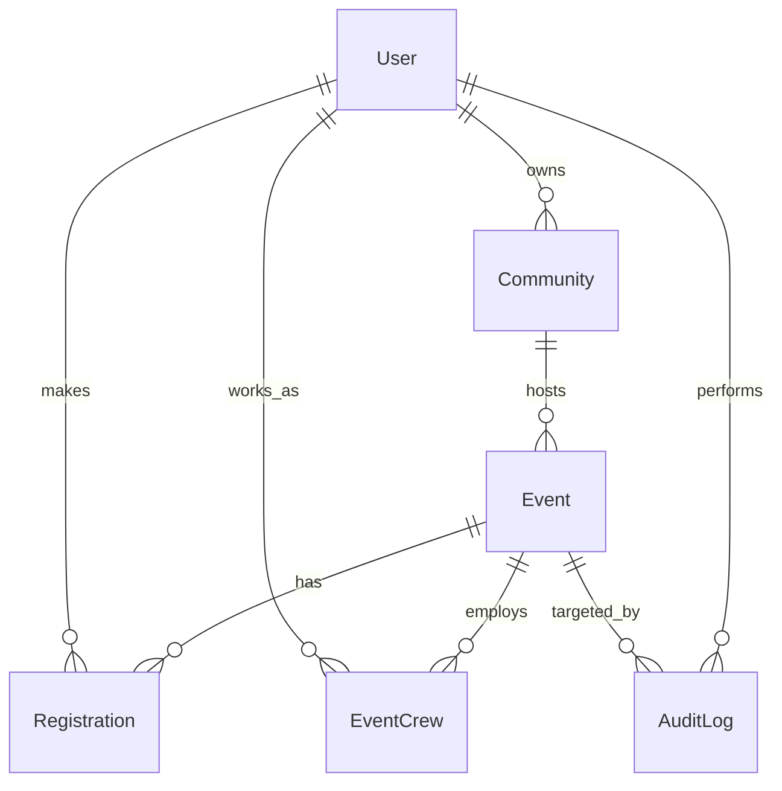

# UniVerse System Architecture Analysis

## 1. Executive Summary

The UniVerse system is a well-structured MERN stack application that strongly adheres to modern Event Management System principles. It implements advanced patterns like Data Snapshots and Audit Logging, aligning well with the `universe_architect` skill. However, there are opportunities to minimize data redundancy (specifically regarding Speakers/Talent) and standardize role management.

## 2. Data Structure & Schema Analysis

### Core Models

The system revolves around three primary pillars: **Identity** (User), **Community** (Community), and **Engagement** (Event/Registration).

| Model            | Type         | Key Relationships                                         | Analysis                                                                                                                                                                                                       |
| :--------------- | :----------- | :-------------------------------------------------------- | :------------------------------------------------------------------------------------------------------------------------------------------------------------------------------------------------------------- |
| **User**         | Identity     | `organizer_id` (Event), `owner_id` (Community)            | **Strength**: Uses `sparse` indexes for `student_id` allowing flexibility.   **Weakness**: Mixed use of `role` (string) and `roles` (array). Recommend standardizing to `roles` array for RBAC scalability. |
| **Community**    | Organization | `owner_id` (User)                                         | **Strength**: Clear ownership model. Includes `stats` for efficient caching.                                                                                                                                   |
| **Event**        | Entity       | `organizer_id`, `community_id`, `venue_id`, `speaker_ids` | **Strength**: Comprehensive status tracking.   **Weakness**: `speaker_ids` (ref `Speaker`) potentially conflicts with `EventCrew` (talent roles).                                                           |
| **Registration** | Transaction  | `event_id`, `user_id`                                     | **Strength**: Implements **Data Snapshots** (`event_snapshot`, `user_snapshot`) reducing read-time lookups (Excellence Pattern). Includes compound unique index.                                               |
| **EventCrew**    | Operations   | `event_id`, `user_id`                                     | **Strength**: Flexible role/department assignment.   **Issue**: Commented out index `event_id` + `user_id` should be enabled to prevent duplicate assignments.                                              |
| **AuditLog**     | Security     | `admin_id`, `target_id`                                   | **Strength**: Comprehensive `action` enum covering critical system mutations. Essential for security compliance.                                                                                               |

### Relationship Diagram (Conceptual)

## 3. Alignment with `universe_architect` Skill

### ✅ Compliant Areas

1.  **Extended Reference Pattern (Snapshots)**: The `Registration` model explicitly stores `event_snapshot` and `user_snapshot`. This perfectly matches the skill's requirement for "Data Snapshots" to optimize read performance for student history.
2.  **Auditability**: The `AuditLog` model is robust and tracks IP, Action, and Target, satisfying the "Security & Auditability" requirement.
3.  **Identity-Linked Schema**: `Community` links to a `User` owner, and `Event` links to `Community` and `Organizer`, creating a clear chain of responsibility.

### ⚠️ Areas for Improvement

1.  **Redundant Talent Management**: The `Event` model has `speaker_ids` (ref `Speaker` model) while `EventCrew` handles `type: 'talent'`. This splits the "Speaker" concept into two places.
    - **Recommendation**: Deprecate `speaker_ids` in `Event` and fully utilize `EventCrew` with `type: 'speaker'` or `type: 'talent'` to unify workforce management.
2.  **Validation**: While Mongoose schemas have definition, the Skill mandates **Joi** for strict schema-level validation.
    - **Recommendation**: Ensure Controller layers implement Joi validation before data hits the Mongoose models.
3.  **Indexing**: `EventCrew` has a commented-out unique index.
    - **Recommendation**: Uncomment `eventCrewSchema.index({ event_id: 1, user_id: 1 }, { unique: true });` to enforce data integrity.

## 4. Best Practices & Performance Recommendations

### 4.1 Database Optimization

- **Predicate Pushdown**: Ensure `Event` queries filter by `date_time` and `status` at the DB level. Add a compound index on `status` + `date_time` for the most common "Upcoming Events" query.
- **Lean Queries**: usage of `.lean()` in Mongoose for read-only operations (like fetching event lists) will significantly reduce memory overhead by returning POJOs instead of full Mongoose Documents.

### 4.2 Restructuring Recommendation

**Objective**: Consolidate "People associated with an Event".

**Current State:**

- `Event.speaker_ids` -> `Speaker` Collection
- `EventCrew` -> `User` Collection (for AJKs)

**Proposed State:**

- **Unified Workforce**: Use `EventCrew` for ALL humans involved.
  - Add `is_guest: Boolean` to `EventCrew` to handle non-student Speakers.
  - Remove `speaker_ids` from `Event` model.
- **Benefit**: Single source of truth for "Who is at this event?". simplifies "Certificate Generation" and "Attendance" logic for staff/speakers.

### 4.3 Security

- **RBAC**: The `User` model has both `role` (String) and `roles` (Array).
  - **Fix**: Migrate completely to `roles` (Array) to support users who might be both `Staff` AND `Organizer`.
  - **Enforcement**: Middleware should check `req.user.roles.includes('admin')` rather than `req.user.role === 'admin'`.

## 5. Summary of Actionable Items

1.  **Database**: Enable unique index on `EventCrew`. Add compound index `status` + `date_time` on `Event`.
2.  **Refactor**: standardise User roles to `roles` array.
3.  **Refactor**: Merge `Speaker` logic into `EventCrew` to remove potential duality.
