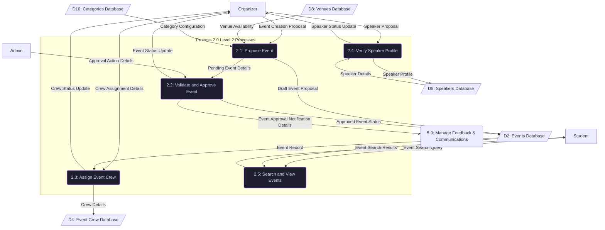
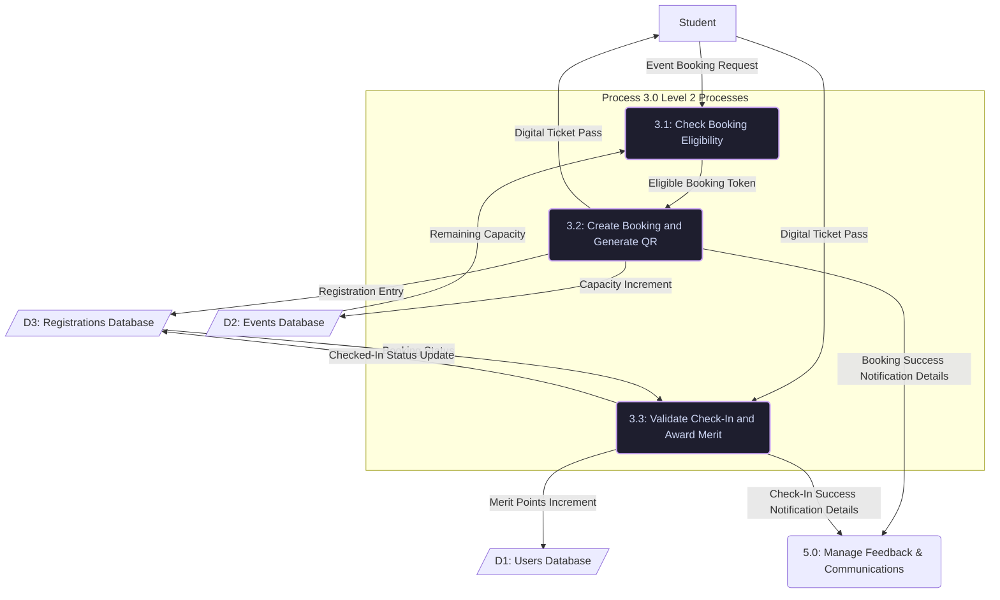

# UniVerse Event System - Data Flow Diagrams (DFD)

This document defines the Data Flow Diagrams (DFD) for the **UniVerse Event System** up to Level 2. The design follows the **Gane and Sarson DFD model** and is derived directly from the [UniVerse_Event_System.groovy](file:///c:/Users/Muhammad%20Haziq/UniVerse/UniVerse_Event_System.groovy) ERD.

---

## 📐 DFD Design Constraints & Guidelines

To ensure semantic correctness and alignment with Gane & Sarson standards, the following structural rules are strictly enforced:

*   **Process Naming**: All process labels must start with a **verb** (e.g., *Authenticate*, *Manage*, *Process*, *Govern*, *Verify*). All other elements (Entities, Data Stores, Data Flows) must be named using **nouns**.
*   **No Direct Entity-to-Entity Flow**: External entities (Sources/Sinks) cannot send or receive data directly from one another. A process must mediate.
*   **No Direct Entity-to-Store Flow**: External entities cannot read or write to databases directly. Every database operation must be performed by a process.
*   **No Direct Store-to-Store Flow**: Data stores cannot transfer data directly between each other. A process must handle the retrieval and storage logic.
*   **Process-to-Process Flow**: Direct data flows between two distinct processes are allowed and modeled to show trigger-based notifications and state changes.
*   **Unique Flow Naming**: Every inflow and outflow for a process must have distinct names to represent the transformation of data.
*   **Balancing**: High-level inputs/outputs at the system boundary match low-level inputs/outputs exactly.

---

## 🗂️ Core Design Elements

### External Entities (Sources & Sinks)
1.  **Student**: General campus users who search events, register/book tickets, check-in, propose new student organizations, and leave reviews.
2.  **Organizer**: Club committee members or officers who create event proposals, manage crew staffing, verify guest speakers, and broadcast news.
3.  **Admin**: University administrators who approve event proposals, club creations, configure venues/categories, and review system audit logs.

### Data Stores
*   **D1: Users Database**: Central user credentials, profiles, merit goals, and settings.
*   **D2: Events Database**: Core event documents, schedules, tasks, and capacities.
*   **D3: Registrations Database**: Junction records linking users to events with booking statuses and digital tickets.
*   **D4: Event Crew Database**: Staffing assignments, roles, and crew statuses.
*   **D5: Communities Database**: Registered clubs, logo/banner media, and stats.
*   **D6: Club Proposals Database**: Applications for new club registrations.
*   **D7: Community Members Database**: Club recruitment, roles, and recruitment lifecycle status.
*   **D8: Venues Database**: Campus physical venues, capacities, occupancy, and access details.
*   **D9: Speakers Database**: Speaker profiles, expertise, rating, and proposal statuses.
*   **D10: Categories Database**: Event categories with brand colors and icons.
*   **D11: Reviews Database**: Event feedback, ratings, and atmosphere metrics.
*   **D12: Audit Logs Database**: Append-only security tracking logs for administrative actions.
*   **D13: Notifications Database**: Targeted internal alert records.
*   **D14: Broadcast Logs Database**: Platform-wide and role-scoped campus news hub logs.

---

## 🌐 DFD Level 0: Context Diagram

The Context Diagram defines the system boundary, showing the entire UniVerse Event Platform as a single central process interacting with external entities.

---

## 📊 DFD Level 1: System Flow Diagram

The Level 1 DFD decomposes the system into five main functional sub-processes, mapping data flows to their respective database stores.

```mermaid
graph TB
    %% External Entities
    Student["Student"]
    Organizer["Organizer"]
    Admin["Admin"]

    subgraph Processes [System Processes]
        P1("1.0: Authenticate and Manage Identity")
        P2("2.0: Manage Events & Scheduling")
        P3("3.0: Process Registrations & Bookings")
        P4("4.0: Govern Clubs & Communities")
        P5("5.0: Manage Feedback & Communications")
    end

    subgraph Data_Stores [Databases]
        D1[/"D1: Users Database"/]
        D2[/"D2: Events Database"/]
        D3[/"D3: Registrations Database"/]
        D4[/"D4: Event Crew Database"/]
        D5[/"D5: Communities Database"/]
        D6[/"D6: Club Proposals Database"/]
        D7[/"D7: Community Members Database"/]
        D8[/"D8: Venues Database"/]
        D9[/"D9: Speakers Database"/]
        D10[/"D10: Categories Database"/]
        D11[/"D11: Reviews Database"/]
        D12[/"D12: Audit Logs Database"/]
        D13[/"D13: Notifications Database"/]
        D14[/"D14: Broadcast Logs Database"/]
    end

    %% Process 1.0 (Identity) Flows
    Student -- "Registration Details" --> P1
    Student -- "Login Credentials" --> P1
    Student -- "Profile Preferences" --> P1
    Organizer -- "Login Credentials" --> P1
    Admin -- "Login Credentials" --> P1

    P1 -- "Registration Confirmation" --> Student
    P1 -- "Session Token" --> Student
    P1 -- "Session Token" --> Organizer
    P1 -- "Session Token" --> Admin

    P1 -- "User Account Data" --> D1
    D1 -- "Credential Record" --> P1

    %% Process 2.0 (Events) Flows
    Student -- "Event Search Query" --> P2
    P2 -- "Event Search Results" --> Student

    Organizer -- "Event Creation Proposal" --> P2
    Organizer -- "Crew Assignment Details" --> P2
    Organizer -- "Speaker Proposal" --> P2

    P2 -- "Event Status Update" --> Organizer
    P2 -- "Crew Status Update" --> Organizer
    P2 -- "Speaker Status Update" --> Organizer

    Admin -- "Venue Configuration Data" --> P2
    Admin -- "Category Control Command" --> P2
    P2 -- "Venue Status Report" --> Admin

    P2 -- "Event Document" --> D2
    D2 -- "Event Record" --> P2
    P2 -- "Crew Details" --> D4
    D4 -- "Crew Assignment" --> P2
    P2 -- "Speaker Profile" --> D9
    D9 -- "Speaker Details" --> P2
    P2 -- "Venue Information" --> D8
    D8 -- "Venue Availability" --> P2
    P2 -- "Category Entity" --> D10
    D10 -- "Category Configuration" --> P2

    %% Process 3.0 (Registrations) Flows
    Student -- "Event Booking Request" --> P3
    P3 -- "Digital Ticket Pass" --> Student

    P3 -- "Registration Entry" --> D3
    D3 -- "Booking Status" --> P3
    P3 -- "Capacity Increment" --> D2
    D2 -- "Remaining Capacity" --> P3

    %% Process 4.0 (Clubs) Flows
    Student -- "Club Proposal Form" --> P4
    Organizer -- "Membership Recruitment Status" --> P4
    Admin -- "Approval Action Details" --> P4

    P4 -- "Pending Approvals List" --> Admin
    P4 -- "Member Application List" --> Organizer

    P4 -- "Proposal Document" --> D6
    D6 -- "Proposal Details" --> P4
    P4 -- "Community Info" --> D5
    D5 -- "Community Profile" --> P4
    P4 -- "Membership Status" --> D7
    D7 -- "Membership Record" --> P4

    %% Process 5.0 (Feedback/Communications) Flows
    Student -- "Review Feedback" --> P5
    Organizer -- "Broadcast Message Request" --> P5
    Admin -- "Audit Log Query" --> P5

    P5 -- "Notification Alert" --> Student
    P5 -- "Notification Alert" --> Organizer
    P5 -- "Notification Alert" --> Admin
    P5 -- "Broadcast Success Notice" --> Organizer
    P5 -- "Audit Log Report" --> Admin
    P5 -- "System Analytics Data" --> Admin

    P5 -- "Review Entry" --> D11
    D11 -- "Review Data" --> P5
    P5 -- "Log Entry" --> D12
    D12 -- "Log History" --> P5
    P5 -- "Internal Alert" --> D13
    D13 -- "Notification Message" --> P5
    P5 -- "Broadcast Log" --> D14
    D14 -- "Broadcast Details" --> P5

    %% Process to Process Flows (Trigger-based)
    P4 -- "Promoted User Details" --> P1
    P4 -- "Approved Club Notification Details" --> P5
    P3 -- "Booking Success Notification Details" --> P5
    P2 -- "Event Approval Notification Details" --> P5

    %% Styling Gane & Sarson Style
    style P1 fill:#1e1e2e,stroke:#cba6f7,stroke-width:2px,color:#cdd6f4
    style P2 fill:#1e1e2e,stroke:#cba6f7,stroke-width:2px,color:#cdd6f4
    style P3 fill:#1e1e2e,stroke:#cba6f7,stroke-width:2px,color:#cdd6f4
    style P4 fill:#1e1e2e,stroke:#cba6f7,stroke-width:2px,color:#cdd6f4
    style P5 fill:#1e1e2e,stroke:#cba6f7,stroke-width:2px,color:#cdd6f4

    style Student fill:#313244,stroke:#89b4fa,stroke-width:1px,color:#cdd6f4
    style Organizer fill:#313244,stroke:#f9e2af,stroke-width:1px,color:#cdd6f4
    style Admin fill:#313244,stroke:#f38ba8,stroke-width:1px,color:#cdd6f4
```

---

## 🔍 DFD Level 2: Detailed Sub-processes

### 1. Process 2.0 Decomposed (Manage Events & Scheduling)

Decomposing the lifecycle of proposing, reviewing, staffing, verifying speakers, and searching events.

### 2. Process 3.0 Decomposed (Process Registrations & Bookings)

Decomposing the seat booking reservations, ticketing, and verification check-in workflows.

